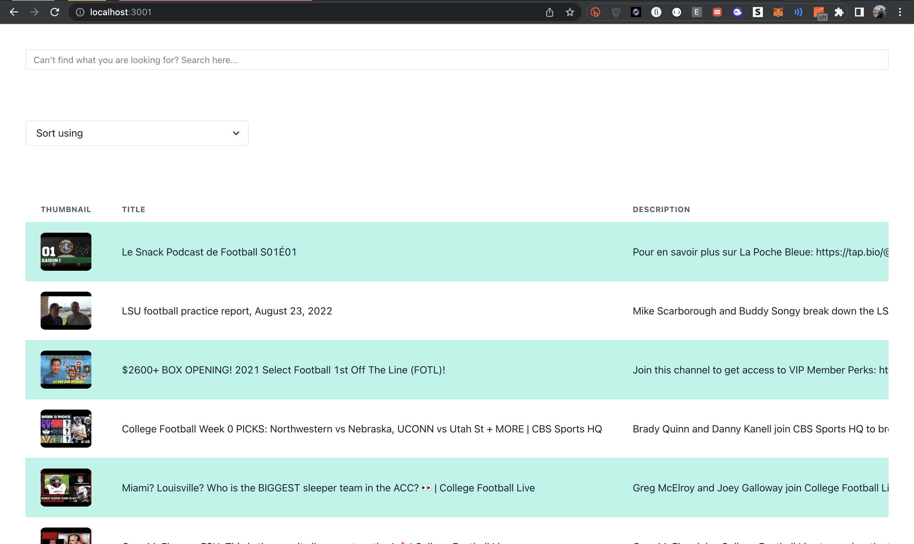

# FamPay-Assignment

Hi recruiters 🙋🏻‍♂️, this is my submission for the assignment-task for the role of ```Backend Engineer``` for which the link can be found: [Notion - Backend Assignment | FamPay](https://www.notion.so/fampay/Backend-Assignment-FamPay-32aa100dbd8a4479878f174ad8f9d990)
## Features Implemented

✅ -  Server should call the YouTube API continuously in background (async) with some interval (say 10 seconds) for fetching the latest videos for a predefined search query and should store the data of videos (specifically these fields - Video title, description, publishing datetime, thumbnails URLs and any other fields you require) in a database with proper indexes.
 
✅ - A GET API which returns the stored video data in a paginated response sorted in descending order of published datetime.

✅ - A basic search API to search the stored videos using their title and description.

- The link to the Postman docs: [Postman docs](https://documenter.getpostman.com/view/10968840/VUqrPd4s)

✅ - Dockerize the project. - ```Dockerfile``` and ```docker-compose.yml```

✅ - It should be scalable and optimised.

✅ - Add support for supplying multiple API keys so that if quota is exhausted on one, it automatically uses the next available key.
- Proof of concept
  


✅ - Make a dashboard to view the stored videos with filters and sorting options (optional)

- It is not the best UI I have designed but given the time constraint and the complexity, this is what I could achieve
  
  


  - The deployed website can be found on: [Link](https://fampay-task.jugaldb.com)


✅ - Optimise search api, so that it's able to search videos containing partial match for the search query in either video title or description.

  Example - Video title may be ```LSU football practice report, August 23, 2022``` and if I search for ```LSU Practice``` it still shows up

  

# Hmm, Lets get a few big questions out of the way quickly. 

## 1. Why in the world would I choose NodeJs to do this task? 🤯

>- Well, JavaScript was listed in the allowed tech stack, while we all know NodeJs


## 2. Why PostgreSQL? 

>- The choice was not quite simple here, historically postgres has been infamous was being not so write-heavy, and struggles with poor perfomance with index creation, often requiring paritioning. So why did I still choose it? 
>-  After my research on the Google's Youtube API, you can only access 10 batch records with pagination at once with 50 records in each batch, which takes the total to ```50*10 = 500 max records```. 
>-  Post which I would need to re run the script anyways to get more data from YouTube, which would give enough buffer to the script to create and update indexes on the DB.
>-  Surely I could've directly opted for some database which offers more robust indexing or could've used partioning, but thinking about the time constraints on this Assignment and scale of the records to which we can really scale it, Postgres seemed like the best option to move forward.
>-  Obviously I am open to comments on these about how can it be better. 

## Installation
## Running the project
- There are multiple ways to run the Project, once you are done with the prerequisites and the basic installation you can use either:

### 1. Using Docker and docker compose.
- Paste the following in your terminal <br>
<code>cd (project directory)</code><br>
```docker build -t <image name> .```<br>

- Open the ```docker-compose.yml``` file <br>
- Change ```jugaldb/fampay-backend:latest``` with your  image name
- Add in the necessary env variables from ```example.env``` file and change the name to ```.env```
- Run ```docker compose up``` to start the server.


### 2. Using npm

- Run the following command to download all the node modules.
```npm install```
- Rename the ```example.env``` file to ```.env``` and add the necessary variables' values.
- Run the project using 
```npm run start```
- This command will build the project and compile the TS to JS and run the JS compiled files under the ```/dist folder```

## Acknowledgments 
## Links